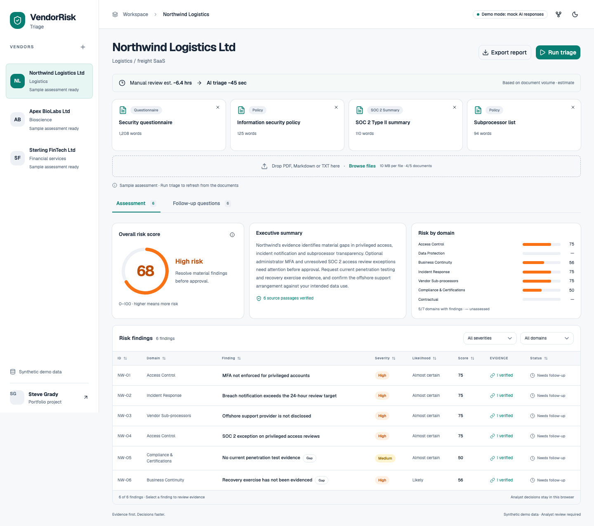
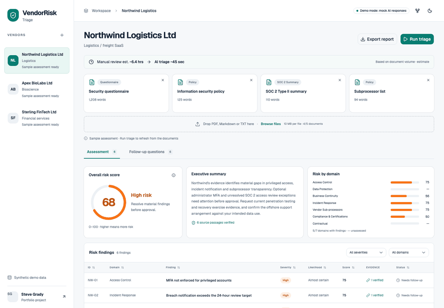
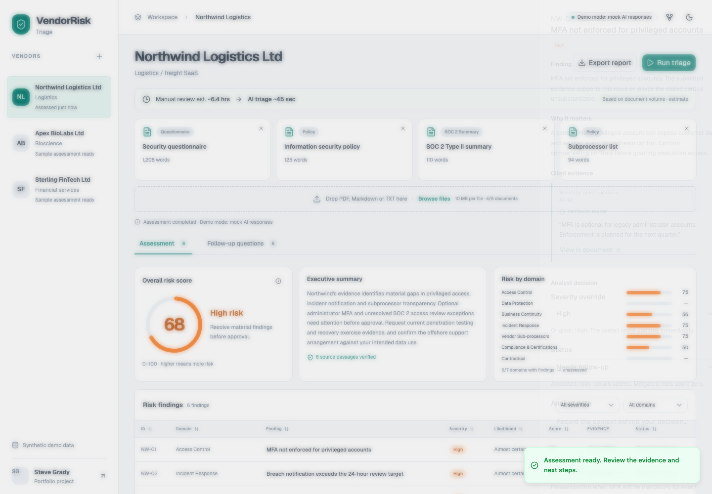
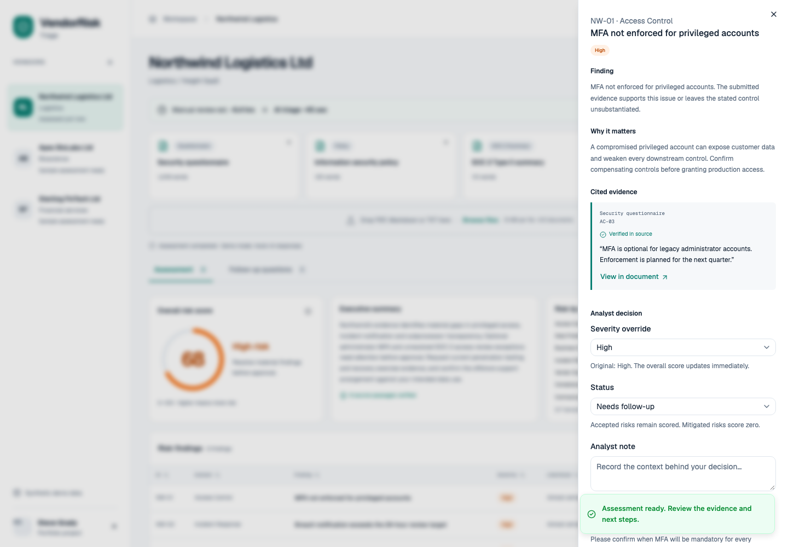
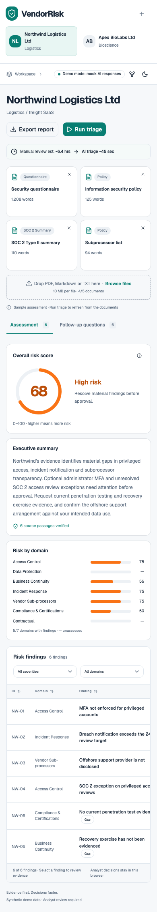
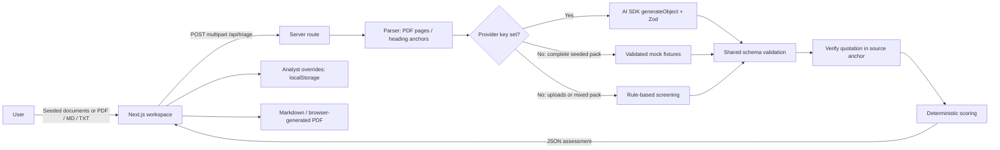

# VendorRisk Triage

Drop in a vendor's security documents and get a scored, cited risk assessment with practical follow-up questions in under a minute.

  

**Live demo:** deployment pending. **[Source](https://github.com/ZeroCool0388/vendor-risk-triage)** · Built by [Steve Grady](https://github.com/ZeroCool0388) · [LinkedIn URL]



## Problem

Third-party risk reviews are slow, manual and inconsistent. Analysts work through questionnaires, policies and assurance reports, then chase evidence and write follow-ups. A score is only useful if the reviewer can trace it to the original material and challenge the decision.

## What it does

- Starts with three fictional vendors and an immediately populated assessment.
- Parses PDF, Markdown and TXT; reviews up to five documents per vendor.
- Produces structured findings, verified source quotations and deterministic domain-weighted scores.
- Lets an analyst change severity, accept or mitigate a risk, record notes and edit follow-up questions.
- Copies a polite vendor email draft and exports complete Markdown and PDF reports.

## Demo



| Evidence drawer                                    | Highlighted citation                                | Mobile workspace                                 |
| -------------------------------------------------- | --------------------------------------------------- | ------------------------------------------------ |
|  |  |  |

**90-second demo script**

1. **0–10 s:** “Third-party risk reviews take analysts hours per vendor. This cuts the first pass to under a minute and keeps a human in control.”
2. **10–25 s:** Show Northwind's four documents and the document-volume estimate: about 6.4 hours manually versus 45 seconds for AI triage. Click **Run triage**; narrate parsing, extraction, scoring and follow-up drafting. The key-free demo stages take roughly 2.6 seconds.
3. **25–45 s:** Show **68 / High**, then the domain breakdown. Open **MFA not enforced for privileged accounts**, show the verified quote, and choose **View in document** to jump to highlighted AC-03.
4. **45–60 s:** Open the penetration-testing evidence gap. Return to MFA, downgrade it to **Medium**, record an analyst note and watch the overall score become **64**. Explain that accepting risk preserves its score; mitigation reduces it.
5. **60–75 s:** Open **Follow-up questions**, edit the MFA question and choose **Copy as email**. This prepares a draft; nothing is sent.
6. **75–90 s:** Export a PDF and show the cited evidence, analyst decisions and synthetic-data footer. Close with: “Same review trail, a fraction of the effort.”

The GIF uses actual application screenshots. Sample assessments are labelled; **Run triage** refreshes the review and generated date.

## How to run

Prerequisites: **Node.js 20.9+** and npm. A current Node LTS release is recommended.

```bash
npm install && npm run dev
```

Open [localhost:3000](http://localhost:3000). No account, database or `.env` file is needed.

```bash
npm run build       # production build
npm start           # serve the production build
npm run lint        # zero warnings required
npm run typecheck   # route types + strict TypeScript
npm run test        # Vitest core/API tests
npx playwright install chromium
npm run test:e2e    # browser smoke, uploads, reports and responsive checks
npm run format      # Prettier
```

**Deploy to Vercel:** import this repository, keep the detected Next.js preset and default build settings, then deploy. Leave provider keys unset on the public demo. The committed `data/` directory is included in the server functions through Next.js file tracing. No database, external storage or `vercel.json` is required.

[](https://vercel.com/new/clone?repository-url=https%3A%2F%2Fgithub.com%2FZeroCool0388%2Fvendor-risk-triage)

**Upload limits:** locally, each file may be up to 10 MB, with five files per review. [Vercel imposes a 4.5 MB function request-body limit](https://vercel.com/docs/functions/limitations), including multipart overhead. For a hosted review, use smaller files and keep the combined payload below that limit; the UI handles a hosting-level 413 with a helpful message. Supporting full 10 MB files on Vercel requires a separate direct-upload storage workflow and is outside this storage-free MVP.

## Demo mode vs live mode

| Mode            | How it is selected                                                  | What runs                                                                                                   |
| --------------- | ------------------------------------------------------------------- | ----------------------------------------------------------------------------------------------------------- |
| Demo            | No key for the selected provider                                    | Exact complete sample packs use committed deterministic fixtures.                                           |
| Rule-based demo | New uploads, mixed documents or a reduced sample pack without a key | Conservative keyword checks, real matched passages, explicit coverage gaps.                                 |
| Live            | Key for the selected provider is set                                | The provider receives parsed text server-side; the same Zod validation, citation checks and scoring follow. |

Copy `.env.example` to `.env.local` for an intentional live test:

```dotenv
LLM_PROVIDER=openai
OPENAI_API_KEY=
ANTHROPIC_API_KEY=
LLM_MODEL=
```

Set one provider key privately on the server. Never use `NEXT_PUBLIC_` for a key. OpenAI defaults to `gpt-4.1-mini`; Anthropic defaults to [`claude-sonnet-5-5`](https://platform.claude.com/docs/en/models/overview). `LLM_MODEL` overrides the default. An unset provider is inferred from available keys, preferring OpenAI if both are present; an explicitly selected provider with no matching key stays in demo mode. The header shows the current review mode and provider/model. A preloaded sample assessment is identified separately from a live run.

A failed provider call returns a friendly error with **Retry triage** and **Run in demo mode instead**. Demo fallback is explicit; it does not silently pass itself off as live AI. The API has a 55-second provider timeout, no automatic provider retries, and a 60-second function budget.

**Verification boundary:** automated adapter tests use controlled provider responses. Successful real OpenAI and Anthropic calls require privately configured keys and have not been claimed as verified. Use the manual matrix in [verification notes](docs/VERIFICATION.md) when enabling live mode.

## Architecture



The server reads sample files at request time and handles uploads in memory. There is no database or persistent server-side document store. Documents are untrusted evidence, not model instructions. The browser owns notes and edited questions; only documents go to the model, and keys never go to the browser.

Shared modules keep extraction, citation verification and scoring independent of the UI and the provider. PDF export loads only when requested. Override storage is versioned, schema-checked and keyed by vendor plus document-content fingerprint; changing the source pack avoids applying unrelated decisions.

**Citation checks:** exact matches first, then Unicode/case/whitespace normalization, then a conservative single-character typo check across a complete token window. Numeric changes, negation changes and short-word changes do not fuzzy-verify. The matched source anchor replaces an inaccurate model location. A fuzzy match shows both the model's quote and the actual source text. Unverified quotations stay visibly flagged in the drawer, table and exports. Verification proves a passage exists, not that the vendor's statement is true.

## How scoring works

The committed [scoring framework](data/scoring-framework.json) is the source of truth.

```text
finding risk = severity × likelihood / 16 × 100
severity: Low 1, Medium 2, High 3, Critical 4
likelihood: Unlikely 1, Possible 2, Likely 3, Almost certain 4

domain risk = mean of its finding risks
overall risk = round(sum(domain risk × weight) / sum(assessed domain weights))
```

| Domain                      | Weight |
| --------------------------- | -----: |
| Access Control              |    22% |
| Data Protection             |    18% |
| Business Continuity         |    15% |
| Incident Response           |    15% |
| Vendor Sub-processors       |    12% |
| Compliance & Certifications |    10% |
| Contractual                 |     8% |

Rating bands: **Low 0–24 · Medium 25–49 · High 50–79 · Critical 80–100**. A domain without findings is **unassessed**, not automatically safe. Accepted risk remains in the score; Mitigated contributes zero while retaining its place in the domain mean. Gaps receive their stated severity and likelihood pending analyst review. Scores and changes describe review findings, not an approval recommendation.

Northwind begins at **68 / High**; changing only NW-01 from High to Medium yields **64 / High**. Apex begins at **71 / High** and Sterling at **23 / Low**. The LLM supplies evidence and findings, not scores: deterministic scoring is repeatable, explainable and independently testable. The **How is this scored?** popover exposes the same rules.

**Time-saved estimate:** manual minutes = `round(words / 4)`; AI seconds = `clamp(round(15 + words / 52), 10, 55)`. Four words per minute is an illustrative allowance for reading, cross-checking and recording controls, not raw reading speed. Northwind's 1,537 words produce about **6.4 hours / 45 seconds**. These are assumptions for ROI discussion, not measured benchmarks or a guaranteed service-level promise. Uploaded word counts update after parsing.

## What I'd tell a customer

“Start with a small vendor cohort and a consistent review policy. Your analysts can get to the first useful assessment quickly, follow each finding back to a source quotation, and retain control over severity, acceptance and mitigation. Pilot one review category, compare the outputs with your existing decisions, and measure time to a defensible review—not just time to a score. Annual value starts with **hours saved per vendor × vendors reviewed per year**. Confirm that evidence quality and escalation decisions hold up before expanding the workflow.”

## Roadmap

- Integrations with GRC and vendor-management systems.
- OCR for scanned PDFs and larger hosted intake through direct uploads.
- Continuous monitoring and reassessment when evidence changes.
- SIG / CAIQ template support and configurable review targets.
- Multi-reviewer workflow, audit history, durable storage and access controls.

## Data & disclaimer

All vendor companies, contacts, domains, questionnaires, policies and assurance summaries are fictional. Every sample document begins with **SYNTHETIC DEMO DATA. Fictional company. Not real.** Contact addresses use `.example`. The three committed packs contain 36 SIG-Lite-style questions each; Apex includes a genuine text-based PDF with its Markdown generation source alongside it.

Use synthetic uploads only. This portfolio demo is not an audit, certification, legal opinion or autonomous vendor approval system. Twenty-four-hour breach notification and four-hour RPO are illustrative review targets, not statements of legal requirements. No emails are sent. New workspaces and uploaded files last for the browser session; notes, severity/status overrides and edited questions persist locally for the same document set. The original author brief is kept locally and excluded from public Git history.

Sample packs can be reproduced with `npm run data:generate`. PDF metadata may vary by generation date; the evidence text and risk fixtures are deterministic.

## Licence

[MIT](LICENSE). Copyright © 2026 Steve Grady.
